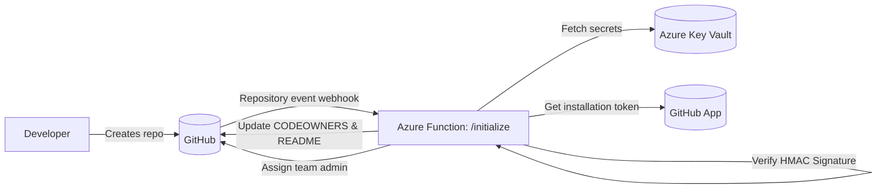
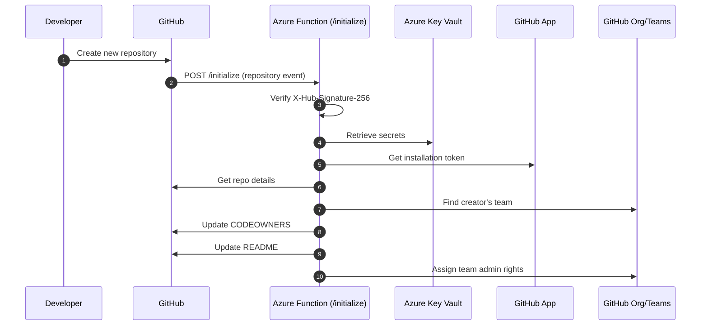

# Repo Guardian — Architecture

Repo Guardian is an Azure Function and GitHub App that enforces repository ownership and standards whenever a new repository.

---

## High-Level Architecture

---

## Sequence: Repository Creation Event

