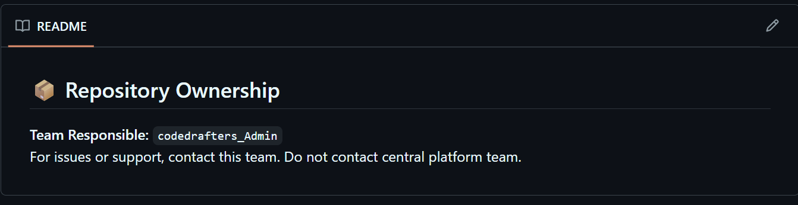
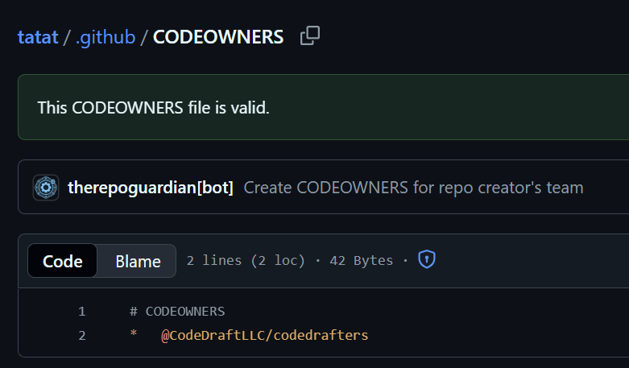
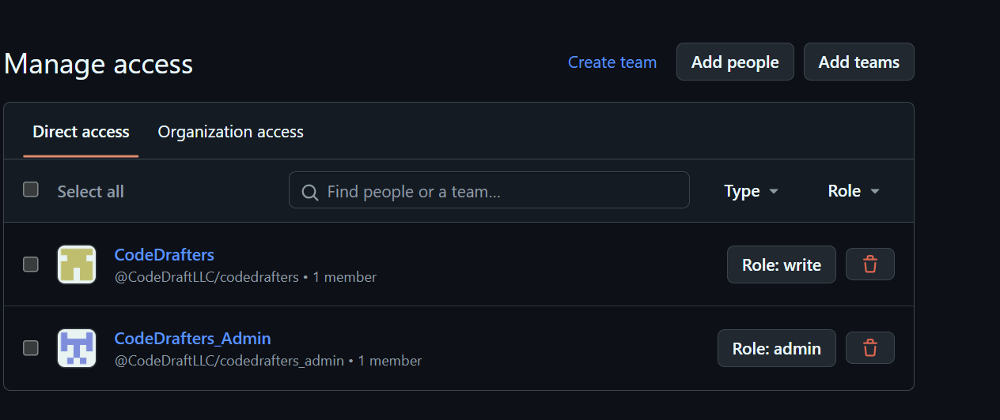

# Draft Notes v0.0.2: Repo Guardian 🐙

🌟 **Editor’s Note**

Not all teams run like FAANG companies with perfect processes. Sometimes the “move fast” approach leads to messy repo management. This week I’m sharing an experiment that tackles one of those pain points: developers creating GitHub repos without thinking twice about permissions.

---

😤 **The Problem: Repo Chaos**

A client faced a challenge: developers wanted to manage their own GitHub repositories, but when given this freedom, they often failed to assign proper permissions to teammates, either forgetting entirely or limiting access to just one colleague.

This created chaos: endless access requests, inconsistent permission levels, and administrative bottlenecks.

---

🎯 **The Mission & Goal**

- **Mission:** Allow developers to manage their own GitHub repositories.  
- **Goal:** Accomplish this without requiring developers to change their behavior.

---

⚡ **The Solution: Repo Guardian**

To address these challenges, I created **Repo Guardian** — a GitHub App that provides automated repository management while maintaining the developer autonomy that teams value.

**How It Works**

When a new repository is created, Repo Guardian automatically:

- 🔑 Identifies the creator and determines their primary team membership (if multiple teams exist, it selects the first one listed)  
- 🛠 Configures team permissions by granting WRITE access to the developer's team and ADMIN access to the corresponding admin team  
- 📄 Creates a `CODEOWNERS` file that references the appropriate team for code review requirements  
- 📘 Generates a `README` with clear ownership information and admin team contact details  

---

🧩 **Problems It Solves**

This automation eliminates common friction points like:

- *"Who can make changes to this repo?"* — Team permissions are automatically configured  
- *"Can you give Jane admin permissions?"* — Admin teams are pre-assigned with proper access levels  
- *"Bob just started and needs access to all the repos I have"* — Team-based permissions scale automatically  

---

🔥 **The End Result**

A repository configured with **best practices from the start**.  
This was the client’s baseline requirement for shifting ownership, but it’s only the beginning — you can layer on more: rule sets, security policies, and advanced configurations as needed.

  
*README.md ownership information*

  
*CODEOWNERS file for repo creator’s team*

  
*Team-based repo permissions configured automatically*

---

🔥 **Why This Matters**

Tools like Repo Guardian represent the essence of effective DevOps: creating automated workflows that eliminate approval bottlenecks, reduce manual ticket overhead, and remove blockers from developers' daily work.

The best solutions work invisibly in the background, requiring zero effort from the people they're designed to help.

---

📎 **Takeaway**

It’s core to DevOps (and honestly any technical engineering) to **meet the organization or team where it’s at** and grow from there. Not every shop will be at the most advanced level in cloud, SDLC, or ownership maturity and that’s fine.

The key is to start by giving autonomy in ways that don’t allow things to blow up while still baking in best practices from day one. Repo Guardian is exactly that: developer freedom without chaos, operational sanity without bottlenecks.