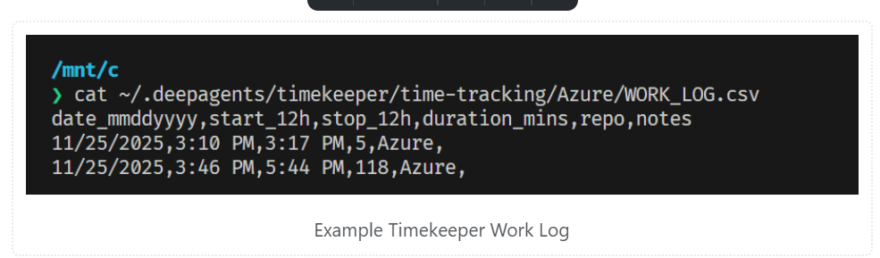

# Draft Notes v0.0.3: Deepagents CLI

🌟 **Editor's Note**

AI-infused CLIs have exploded over the past two years, and I’ve mostly rolled my eyes. The hype cycle has been relentless: every tool claims to “revolutionize your workflow,” when most barely save you a few keystrokes. I’ve been in tech long enough to love a proper bash shell (apologies to PowerShell fans), and I rely on my own battle-tested configurations and preferences.

Most CLI “extras” aren’t life-changing unless you live in the terminal full-time as a Linux engineer.  
But every now and then, something breaks through the noise.

---

## 🔍 The Problem with Most AI CLIs

A lot of AI “agent” CLIs feel like one-trick ponies. Take GitHub’s Copilot Agent: sure, it interacts with GitHub, but between VS Code and the GitHub UI, do we really need another interface to do the same thing? Some folks argue it’s faster to ask a CLI *“What open issues relate to feature X?”* but I’m firmly in the **if it ain’t broke, don’t fix it** camp.

So, for the longest time, none of these agents felt worth adopting.

Then the **deepagents CLI** came along.

---

## ⚡ Why Deepagents Caught My Attention

Unlike the others, deepagents actually *behaves* like an agent. It can:

- Interact with APIs  
- Search the web  
- Maintain memory  
- Follow rules you define  

For the first time, I saw a CLI agent that could meaningfully reduce friction in day-to-day engineering work. I decided to put it to the test—not for gimmicks, but for the kinds of tasks that are genuinely tedious even with AI tools.

Two pain points came to mind immediately.

---

## 🕒 Time Tracking (The Eternal Annoyance)

Even if you’re not a contractor, engineers often need to track how long they spend writing code, building infra, debugging pipelines, and so on. Accurate time logs help with workload visibility and future forecasting… but the process is awful.

There are VS Code extensions that passively track time, but they don’t help when your company uses JIRA or another planning tool—you still have to manually enter the numbers in the right work item.

Some tools claim JIRA integration, but at **$15–$30 per user per month**, paying extra just to track time feels absurd.

---

### 🛠 Enter the Timekeeper Agent

So I built a **timekeeper agent** in deepagents. It follows a rule set I defined. It:

- Detects the repo I’m working in  
- Records start/stop times (I still trigger those manually)  
- Logs everything cleanly and consistently  

[Timekeeper agent rules](./timekeeper_rules.md)

All I needed was:

- My existing OpenAI API key  
- A small setup  
- A few rules  

And the output? Beautiful.

---

### Example TimeKeeper Work Log

  
*Work Log*

Since deepagents can call external APIs, extending this to JIRA would be trivial:

**Branch name → match the work item → log the recorded time.**

---

## 🧱 Tracking Work for Repetitive Multi-Clone Tasks

Recently I’ve been converting a Slack app to Microsoft Teams. Same commands, new platform. The work is repetitive but requires precision: adding the right bot framework and Teams SDK elements so messages flow correctly.

You’d think an AI coding agent could handle this reliably, right?

---

### 😬 Reality Check

No matter what model you use, agents make mistakes. I’ve tried asking Copilot to:

> “Convert this code and make identical changes across the remaining commands.”

Even with chain-of-thought, step-by-step prompts… results were inconsistent.

And documenting the process manually is painful. PRs help, but for multi-file changes, it’s tough to compress the logic into a clean GitHub Issue without writing a novel.

---

### 🛠 Enter the Work-Tracking Agent

So I built a **second deepagent agent**. This one monitors:

- My git diff  
- Any notes I give it  
- Any steps I flag as important  

[Command Template agent rules](./command-tracker.md)

It stores everything. Then, when I’m done, I ask it to generate a **GitHub Issue template** describing the required changes: clear, concise, and repeatable.

I created one issue template, made small edits for each command, generated four GitHub issues, assigned them to Copilot… and the results were incredible.

Within about an hour:

- All four conversions were complete  
- Mistakes were minimal  
- I was free to work on other things  
- My job was reduced to testing and applying small fixes  

This wasn’t just automation — it felt like having a junior engineer taking notes for me in real time.

---

## 💡 Why This Matters

This is the kind of AI help that actually moves the needle.  
Not flashy *“agents that code for hours”* claims, but practical, memory-powered assistants that:

- Track details you’d otherwise forget  
- Follow rules you define  
- Reduce cognitive overhead  
- Make repetitive engineering tasks painless  

To me, this is huge — it gives you the space to focus on complex work while the agent handles the administrative burden.

---

## 🔚 Closing Thoughts

For the first time, I feel like AI agents in the terminal are delivering on real value, not hype.

Deepagents turned two long-standing annoyances into smooth, automated workflows. It’s the closest thing I’ve had to a personal engineering assistant that takes notes, tracks changes, and handles the boring stuff without me babysitting it.

If this is where CLI-based agents are heading, I’m here for it.

